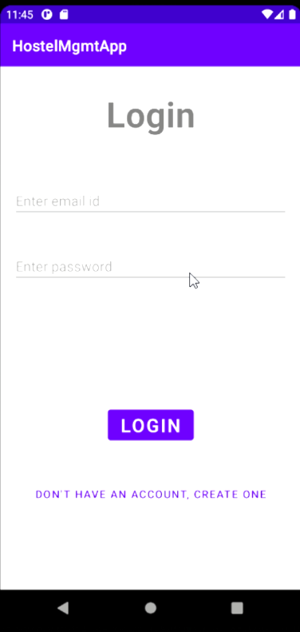
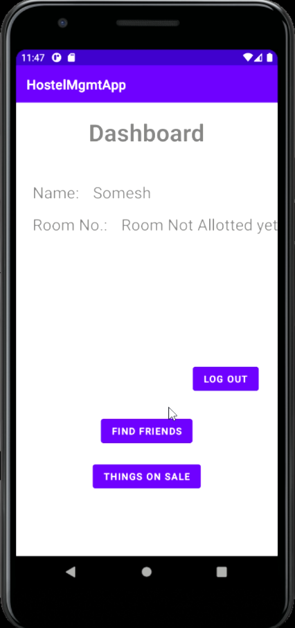

<h1 align="center">Hostel Management</h1>

## Table of Contents:
  1. [Introduction](#Introduction)
  2. [Technology Stack](#TechnologyStack)
  3. [Features](#Features)
  4. [Screenshots and Video](#ScreenshotsandVideo)
  5. [Progress](#Progress)
  6. [Contributors](#Contributors)

## Introduction
  Intro of the project

## Technology Stack
  1) Android
  2) Firebase
  3) Firestore

## Features
  - Hostellers profiles to interact with the Hostel Admin
  - Hostellers can find the room no of other Hostellers
  - Alotement of Rooms while moving from one hostel to another
  - A market place where students can sell their second products
  - A chat window

## Screenshots and Video

Working [Video](https://drive.google.com/file/d/166G1a1_eoa5DLRagqEn9I35GQg6jzbbc/view?usp=sharing) of the current progress

## Progress
  The current version of the app can only register a Hostellers into the system and when room is alotted it will be displayed in the Dashboard.
  
  Details of other hostellers are fetched but unable to display it using a dynamic table.
  
  No work on Market place and chat window is done.

## Contributors:

Team Name: sudo mv /* /dev/null

* [Somesh Banerjee](https://github.com/somesh-banerjee)
* [Suraj Jaiswal](https://github.com/)
* [USP Anupam](https://github.com/)

### Made at:

